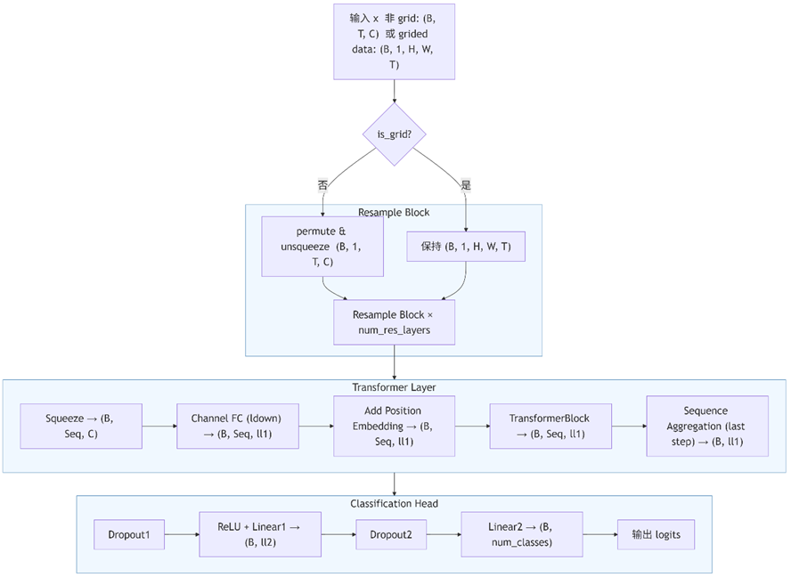

# EEG_Emotion_Classification_SEED
Using SEED dataset,  CNN with SE module and a Transformer for temporal encoding, achieve an acuraccy of 94.77 ± 0.34 %

models.py is the original net design from [patrickdmiller/SEED-EEG-Deep-neural-network: residual deep cnn and lstm for classifying SEED data](https://github.com/patrickdmiller/SEED-EEG-Deep-neural-network)
modeltest.py is the new modified net design. Added SE module in deep cnn and replace lstm as a transformer module

.png).png).png)

.png)

.png)
